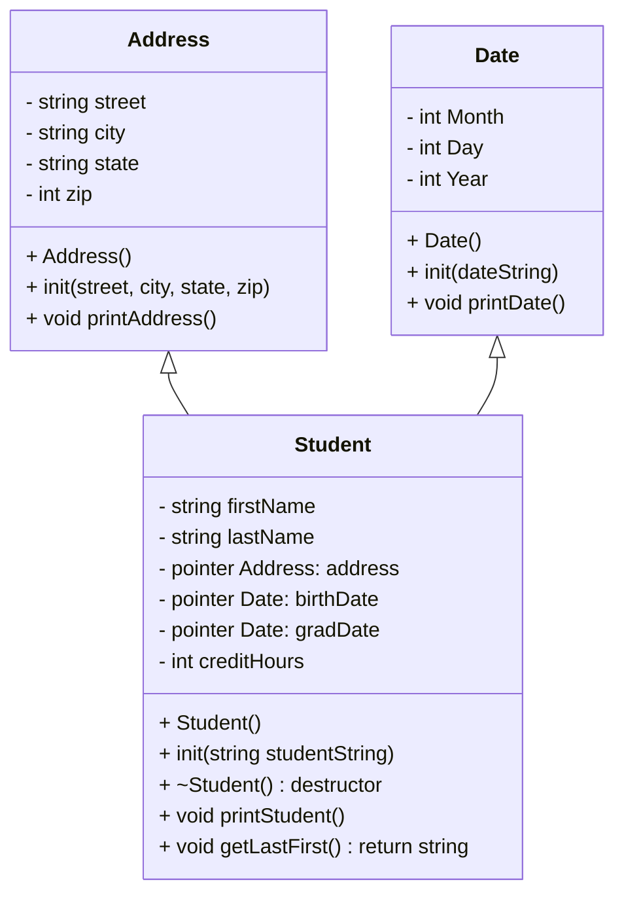

# Heap of Students Documentation

## UML diagram

## Rest of Algorithm

## Finished make file should be:

'''
//make file

program: main.o student.o date.o address.o
        g++ -g main.o student.o date.o address.o -o program

main.o: main.cpp student.h date.h address.h
        g++ -g -c main.cpp

student.o: student.h date.h address.h student.cpp
        g++ -g -c student.cpp

date.o: date.h date.cpp
        g++ -g -c date.cpp

address.o: address.h address.cpp
        g++ -g -c address.cpp

clean:
        rm program
        rm *.o

run: program
        ./program

debug: program
        gdb program

valgrind: program
        valgrind --leakcheck=full ./program
~                                                    
'''

In date() 
add an array of 13 string values starting with null as 0 so that jan = 1 etc.

Address takes in 4 strings and prints them out

Try student
student takes in all data and makes them into smaller ones
