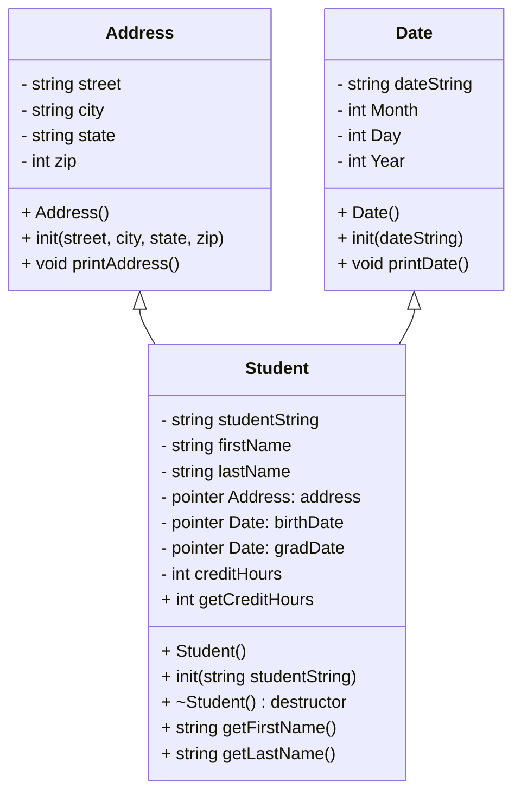

# Heap of Students Documentation

## UML diagram

## Rest of Algorithm

### Finished make file should be:

'''
//make file

program: main.o student.o date.o address.o
        g++ -g main.o student.o date.o address.o -o program

main.o: main.cpp student.h date.h address.h
        g++ -g -c main.cpp

student.o: student.h date.h address.h student.cpp
        g++ -g -c student.cpp

date.o: date.h date.cpp
        g++ -g -c date.cpp

address.o: address.h address.cpp
        g++ -g -c address.cpp

clean:
        rm program
        rm *.o

run: program
        ./program

debug: program
        gdb program

valgrind: program
        valgrind --leakcheck=full ./program
~                                                    
'''

In date() 
add an array of 13 string values starting with null as 0 so that jan = 1 etc.

Address takes in 4 strings and prints them out

# New main notes from teacher!!!!

main()
1. should open the students.csv file
2. should create a vector of student pointers
3. should load each student from a line of all the students
4. present a menu to the user
   - quit
   - print the names of all the students
   - print details of all the students
   - search for a student
   - *sort the students (blackbelt*
     
5. the user should be able to choose from at least those three options
6. when user quits:
   - the program cleans up the vector (vector will be on the heap)
   - close the student file
   - exit

### this function is a traffic cop:
	- load vector, 
	- loop until user quits, 
	- offer menu, 
	- perform task based on input, 
	- clear vector

will likely be a dictionary 0, 1, 2, 3, 4 being the keys
check back to choose adventure usage of dictionary for refreshing how this may work

## Functions in main
### **make sure vector is passed by reference !!**

std::string menu()
	- print the menu options with their indices
	- request user input
	- menu should **return** user's input as a string (into a variable named input)
		* **ask for numeric input to not bother with capitalization**
		* **numeric input but as a string to not bother with conversion**
		* **exception handling is not required -> that will happen in main**
	return input

quit()
	- end the while loop in main (keepGoing = False)

printNames(students *vector&)
	- go through list of students and print first and last name *for* each

printDetails(students *vector&)
	- take a reference to students vector
	- go thrpugh each student and print full data
	- implement a line to separate student data

search(students *vector&)
	- start by asking user for input which is students last name
	- checks the data file to find a student with a matching name
		* R should return last name that start with R
		* look into string.find() method  to see how to search for a substring in a string
	- if can't find a match (std::string::npos) reply with message

loadStudents(students *vector&)
	- open up the students.csv file
	- for each line of the file:
		* create a student instance on the heap
		* initialize that instance with the string from the csv file
		* append that instance to the vector at the end
	- close the file
	**needs to work with a reference to the students vector so it can chang the vector in place**

deleteStudents(students *vector&) - deleted the vector
	- loop through each element in the students vector
	- for that element delete (it) 
	- **check with valgrind that everything was cleared**

## **_probably best to pass as a reference to a vector pointer to students!!!_**
### **make sure vector is passed by reference regardless!!**

*sort(students vector) (this is the blackbelt extension*
	- public getters for last name, first name, and credit hours may be necessary to access them by sort
	- will need a comparator function for each sort
	- add sorting options to the menu so user can choose between them
**(he said a few more functions may be needed for sorting -> sortByLast() sortByFirst() sortByCreds())**

