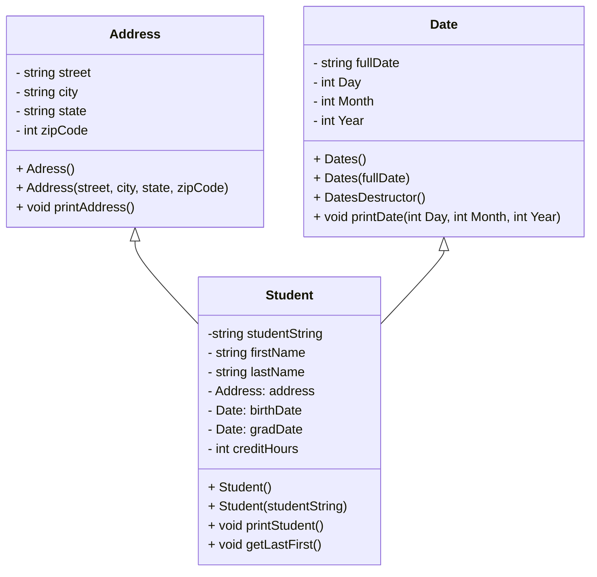

# Heap of Students Documentation

## UML diagram

```mermaid
classDiagram
direction TB
    class Address {
	    - string street
	    - string city
	    - string state
	    - int zipCode
	    + Adress()
	    + Address(street, city, state, zipCode)
	    + void printAddress()
    }

    class Date {
	    - string fullDate
	    - int Day
	    - int Month
	    - int Year
	    + Dates()
	    + Dates(fullDate)
	    + DatesDestructor()
	    + void printDate(int Day, int Month, int Year)
    }

    class Student {
	    -string studentString
	    - string firstName
	    - string lastName
        - Address: address
	    - Date: birthDate
	    - Date: gradDate
	    - int creditHours
	    + Student()
	    + Student(studentString)
	    + void printStudent()
	    + void getLastFirst()
    }

    Address <|-- Student
    Date <|-- Student
```

